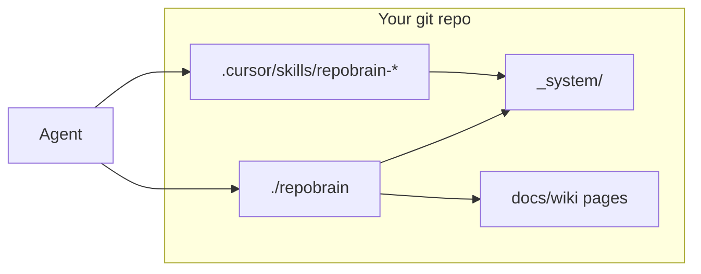
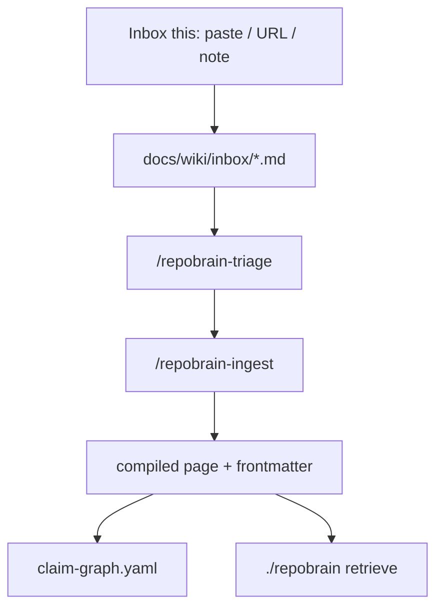
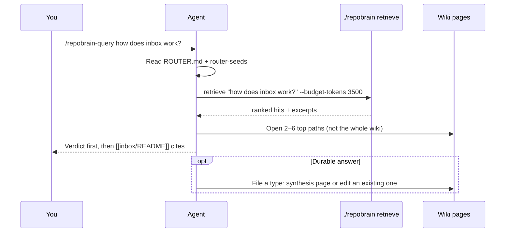
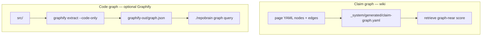
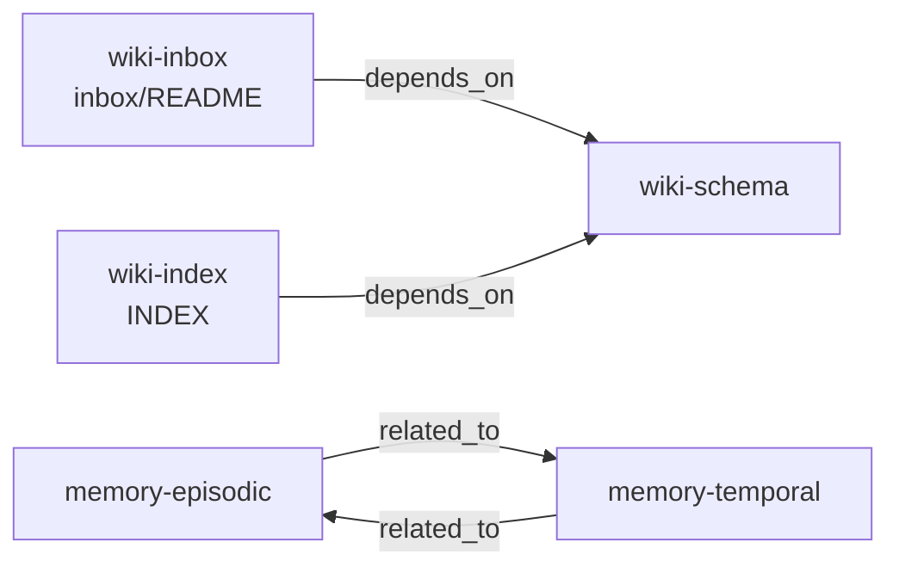

# How RepoBrain works

RepoBrain is a **file pack** in your git repo. It is not an MCP server, a
Cursor marketplace plugin, or a hosted RAG API. After install, the brain is
the files on disk.

## Two parts

| Part | Where | What |
|------|--------|------|
| Engine | `./repobrain`, `docs/wiki/_system/` | Skills, scripts, schema, router |
| Host wiki | `docs/wiki/` minus `_system/` | **Your** claims |

Install copies the engine only. Thin launchers in `.cursor/skills/repobrain-*`
point at `_system/skills/`. Without `_system/`, those launchers are empty.



## Three kinds of knowledge

1. **Raw** — README, source, PDFs, ADRs. Inventory, not compiled truth.
2. **Inbox / episodes / timeline** — notes until triage → ingest.
3. **Compiled pages** — reviewed markdown with schema frontmatter. This is
   what retrieve should cite.



## What `./repobrain retrieve` does

Retrieve is **file RAG**. It does not call an embedding API. It walks wiki
markdown (skipping `_system/`), scores **sections**, and prints a ranked list
that fits `--budget-tokens`.

It is a **search engine**, not an answer. The CLI never writes an essay.

### Scoring

| Signal | Weight | What it uses |
|---|---:|---|
| Lexical | 0.40 | Query tokens vs title, tags, heading, body |
| Frontmatter / `read_when` / tags | 0.15 | YAML on the page |
| Graph proximity | 0.15 | One hop on the **claim** graph (page `edges`) |
| Temporal fit | 0.15 | `temporal.valid_until`, recency, `--as-of` |
| Type prior | 0.05 | `concept` ranks above `inbox-item` |
| MMR diversity | 0.10 | Avoid eight copies of the same page |

No embeddings until a corpus is huge (hundreds of pages). Inbox items with
`type: inbox-item` are skipped. Compiled pages beat conflicting raw sources.

Useful flags: `--k 8`, `--lane semantic\|episodic\|temporal\|meta\|all`,
`--as-of YYYY-MM-DD`, `--json`, `--include-sources` (raw, non-authoritative),
`--code` (also run Graphify if the code graph exists).

### What it prints (real output)

From an empty bootstrap (`host-app`, no Graphify, no Trell pages):

```text
# retrieve: 'inbox drop zone unprocessed knowledge'
# lane=all as_of=none hits=8 ~tokens=1019
# code-graph: missing graphify-out/graph.json — repobrain graph sync

1. [0.833] inbox/README.md › Inbox
   id=inbox-readme type=meta lex=1.0 graph=1.0 temporal=0.835
   why: lexical+graph-near+temporal-fit+read_when/tags
   This folder is the **only approved on-ramp** for messy new material.  …

5. [0.411] INDEX.md › host-app wiki index
   id=wiki-index type=index lex=0.3778 graph=0.2456 temporal=0.835
   why: lexical+temporal-fit
   Agent bootstrap: `AGENTS.md` → `docs/wiki/_system/docs/ROUTER.md` → retrieve. …
```

How to read one hit:

| Field | Meaning |
|-------|---------|
| `1. [0.833]` | Rank and combined score |
| `inbox/README.md › Inbox` | Path and `##` heading (a **section**, not the whole file) |
| `id` / `type` | Frontmatter |
| `lex` / `graph` / `temporal` | The three main sub-scores |
| `why` | Which signals fired |
| excerpt | First ~220 characters of that section |
| `code-graph: missing…` | Optional Graphify is not installed; wiki hits still work |

`--json` adds the same hits as objects (`path`, `score`, `excerpt`,
`provenance`, …) plus `packed_tokens` vs `budget_tokens`.

## Skills: retrieve vs query (do not rename)

There are already **two** skills. Do not collapse `/repobrain-query` into
`/repobrain-retrieve`.

| Name | Kind | Job |
|------|------|-----|
| `./repobrain retrieve` | CLI | Rank sections, print hits |
| `/repobrain-retrieve` | Skill wrapping that CLI | Run retrieve, open top 1–3 paths |
| `/repobrain-query` | Playbook **only** — no `./repobrain query` | After retrieve: write an answer with `[[cites]]` |
| `/repobrain-navigate` | Playbook only | After retrieve: a map of links, not an essay |
| `./repobrain graph query` | CLI (optional Graphify) | Code symbols, not wiki |

Lookup is retrieve. Query is **what the agent does with the hits**. Renaming
query to retrieve would collide with the existing retrieve skill and hide
that split.



### What `/repobrain-query` actually does

Canonical playbook: [`repobrain-query/SKILL.md`](../skills/repobrain-query/SKILL.md).

1. Router seeds for the intent (do not dump `INDEX.md`).
2. `./repobrain retrieve "<question>" --budget-tokens 3500`
   - decisions → `--lane episodic`
   - when / as-of → `--as-of` and/or `--lane temporal`
   - who-calls / lexer / parser → `./repobrain graph query` (sync first if
     `graphify-out/graph.json` is missing)
3. Read 2–6 top **sections**.
4. Answer: verdict first, citations `[[folder/page]]`, no invented stats.
5. If the answer should last, ingest it onto a compiled page (`type: synthesis`
   or an existing page). Episodes are not truth until consolidated.

`/repobrain-retrieve` stops at step 3: you get the hit list. `/repobrain-query`
continues through 4–5: you get a cited answer.

## Two graphs (do not mix them)



| Graph | File | Needs Graphify? | Answers |
|-------|------|-----------------|--------|
| Claims | `_system/generated/claim-graph.yaml` | No | “Which pages relate?” |
| Code | `graphify-out/graph.json` (gitignored) | **Yes** | “What calls `foo`?” |

`./repobrain retrieve` uses the wiki plus the claim index. It does not need
Graphify. Missing `graphify-out/graph.json` only disables `graph query`.

### Real claim graph (empty host after bootstrap)

```yaml
nodes:
- id: wiki-inbox
  page: inbox/README
- id: wiki-index
  page: INDEX
- id: wiki-schema
  page: null
- id: memory-episodic
  page: episodic/INDEX
- id: memory-temporal
  page: temporal/TIMELINE
edges:
- from: wiki-inbox
  to: wiki-schema
  rel: depends_on
- from: wiki-index
  to: wiki-schema
  rel: depends_on
- from: memory-episodic
  to: memory-temporal
  rel: related_to
```



That `depends_on` hop is why the inbox hit above shows `graph=1.0` /
`graph-near`. Rebuild after frontmatter edits:

```bash
python3 docs/wiki/_system/scripts/sync_graph.py
```

## Graphify (optional)

You do not have to install or use Graphify.

RepoBrain talks to Graphify through an **adapter**
([`GRAPHIFY.md`](GRAPHIFY.md)). Graphify owns parsing and the code graph.
RepoBrain owns config, `./repobrain graph sync`, and diagnostics. RepoBrain
does not vendor Graphify.

- Upstream: [Graphify-Labs/graphify](https://github.com/Graphify-Labs/graphify)
- PyPI package: `graphifyy` (CLI command is still `graphify`)
- Supported range: `graphifyy>=0.9.54,<0.10`

Skip it unless you want agents to query **code** structure. Wiki install,
retrieve, inbox, and doctor work without it.

## Router (why agents must not dump the wiki)

[`ROUTER.md`](ROUTER.md) is the always-on map: `AGENTS.md` + this router + the
user question (~2k tokens). Then retrieve (~3.5k). Not `INDEX.md` plus every
domain folder.

## What install does not do

It does not copy another host's compiled pages. It does not invent a
`docs/wiki/core/` folder. It does not require Graphify or MarkItDown.
