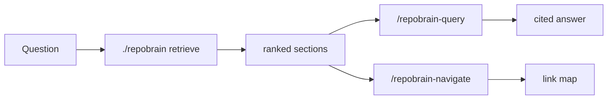

# Using RepoBrain

After [Quick Start](QUICKSTART.md), stay on these loops. Do not dump the wiki
into chat. How retrieve is scored and how the graphs connect:
[HOW-IT-WORKS.md](HOW-IT-WORKS.md).

## Ask a question

Two different tools. Use both, in order.



### 1. Lookup — `/repobrain-retrieve` or the CLI

```bash
./repobrain retrieve "<question>" --budget-tokens 3500
```

There is no `./repobrain query` command. Lookup is always `retrieve`.

Real output from an empty install (`./repobrain retrieve "inbox drop zone unprocessed knowledge"`):

```text
# retrieve: 'inbox drop zone unprocessed knowledge'
# lane=all as_of=none hits=8 ~tokens=1019
# code-graph: missing graphify-out/graph.json — repobrain graph sync

1. [0.833] inbox/README.md › Inbox
   id=inbox-readme type=meta lex=1.0 graph=1.0 temporal=0.835
   why: lexical+graph-near+temporal-fit+read_when/tags
   This folder is the **only approved on-ramp** for messy new material.  …
```

Open the **top paths**, not the whole wiki. `› Inbox` is a heading. `why`
tells you it matched words, sat near a claim-graph neighbor, and was still
valid in time. `code-graph: missing` is fine: wiki hits still ranked.

You do **not** need a word-for-word match of the whole question. You **do**
need overlapping tokens (or aliases in `tags` / `read_when`). Retrieve does
not know synonyms. If `why` is only `temporal-fit` and `lex` is ~0, that
hit list is recency noise — rephrase from
`docs/wiki/_system/config/router-seeds.md`, or plant the alias on the page.
Do not answer from those hits. Details:
[HOW-IT-WORKS.md](HOW-IT-WORKS.md#if-the-question-does-not-match-word-for-word).

Lanes:

```bash
./repobrain retrieve "what did we decide" --lane episodic --budget-tokens 3500
./repobrain retrieve "what changed" --as-of 2026-09-12 --lane temporal
```

### 2. Answer — `/repobrain-query` (keep this name)

Do **not** rename this to `/repobrain-retrieve`. Retrieve already exists and
only runs the search. Query is the playbook that **answers**.

After the hit list, the agent:

1. Reads 2–6 top sections.
2. States a verdict first.
3. Cites `[[inbox/README]]` (wikilinks), not dumped INDEX.
4. Optionally files a `type: synthesis` page so the answer compounds.

Example shape (after the hit list above):

> Inbox is the only on-ramp for messy notes. Items are not wiki truth until
> triage → ingest. See [[inbox/README]].

Playbook: [`repobrain-query/SKILL.md`](../skills/repobrain-query/SKILL.md).

Want a map instead of an essay? `/repobrain-navigate` — same retrieve, then
wikilinks + one-liners.

### 3. Code wiring (optional Graphify)

Skip this unless the question is about **source structure**.

```bash
./repobrain graph sync          # if graphify-out/graph.json is missing
./repobrain graph query "<symbol or question>"
```

Open only named `source_file`s. See
[HOW-IT-WORKS.md](HOW-IT-WORKS.md#graphify-optional).

## Add a note


Drop messy material in `docs/wiki/inbox/`, or tell an agent:

> Inbox this: \<paste\>

Then **triage** (classify) → **ingest** (write a real page). Inbox items are
not citable until ingested.

Do not invent a new top-level folder because a note feels important. Add the
domain in `HOST.yaml` first, or leave the item as `needs-human`.

## Check health

```bash
./repobrain doctor
```

Fix critical/high findings. Do not invent taxonomy to silence doctor.
Heal playbook: [`repobrain-heal`](../skills/repobrain-heal/SKILL.md).

## Fill HOST.yaml

- `name` — this repository
- `anchor` — one paragraph the wiki must not dilute
- `router-seeds.md` — your keywords → your pages
- `domains` / `semantic_dirs` — folders you actually have

Optional: Graphify roots, MarkItDown conversion.

## Commands you will actually run

```bash
./repobrain retrieve "<question>" --budget-tokens 3500
./repobrain doctor
./repobrain graph query "<symbol>"    # optional; needs Graphify
```

| Want | Use |
|------|-----|
| Hit list | `/repobrain-retrieve` |
| Cited answer | `/repobrain-query` (runs retrieve first) |
| Link map | `/repobrain-navigate` |

Full verb list: [`CHEATSHEET.md`](CHEATSHEET.md). Agents: [`ROUTER.md`](ROUTER.md).
